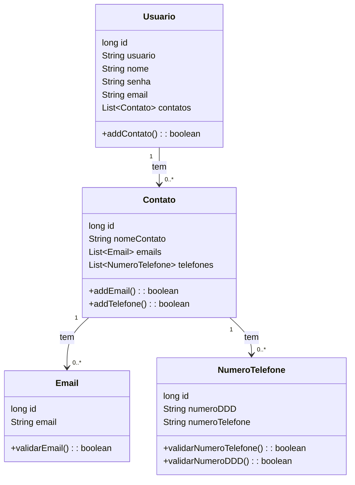
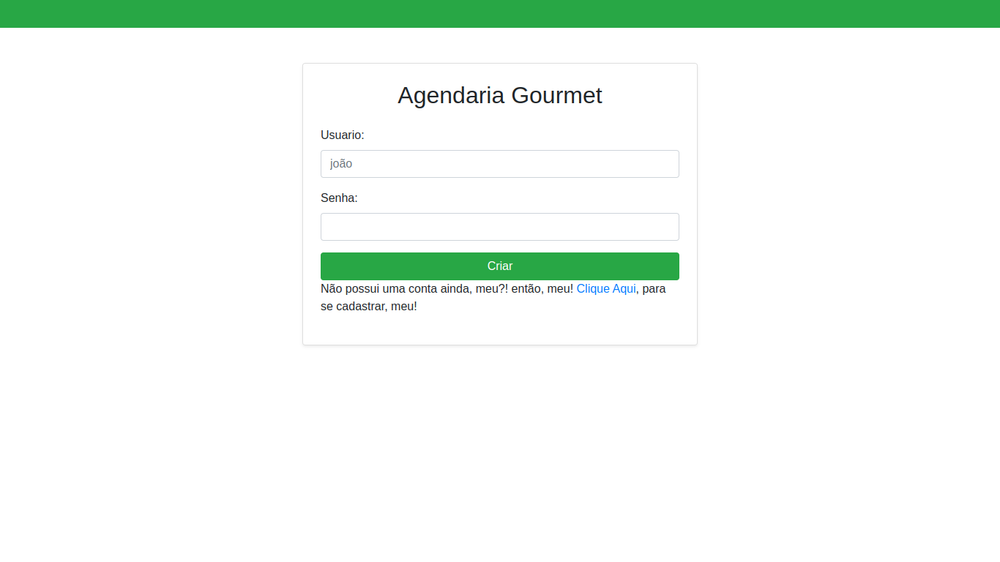
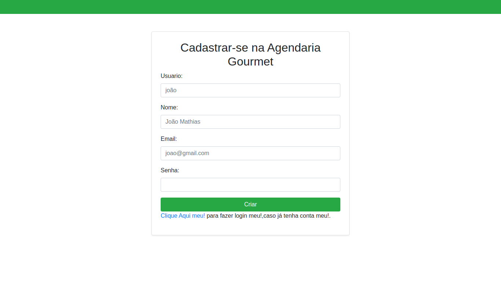
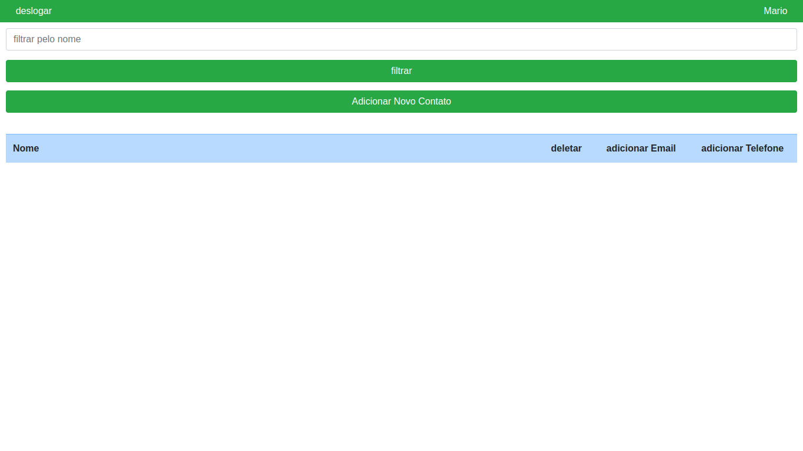
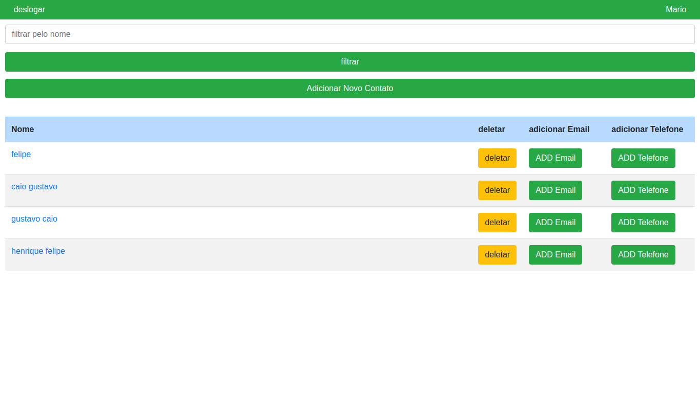
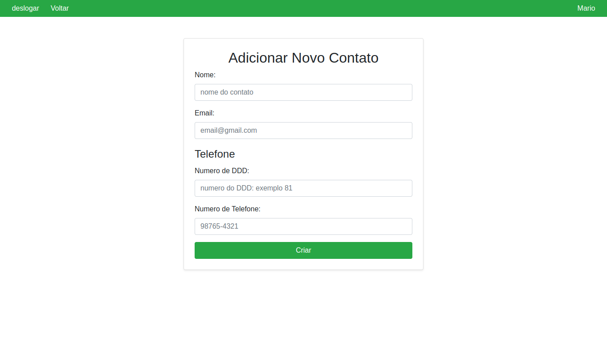
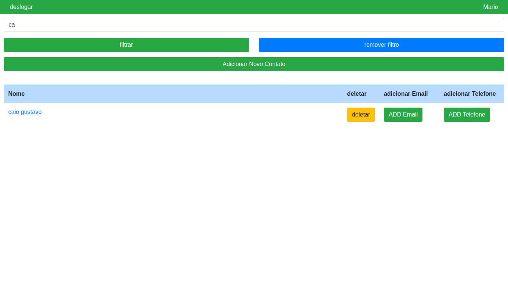

# AgendariaGoumert

## Descrição do projeto
Projeto para a disciplina de Desenvolvimento de Aplicações Web 2. O objetivo do projeto é desenvolver um sistema seguindo as especificações do professor.

Descrição fornecida: O sistema a ser desenvolvido será uma agenda online utilizando Spring Web MVC, Thymeleaf e banco de dados. As funcionalidades são as seguintes:

- O usuário pode se cadastrar no sistema.
- O usuário pode se logar no sistema.
- Uma vez logado, o usuário pode alterar a senha e as informações de perfil.
- Uma vez logado, o usuário pode cadastrar contatos.
- Na tela inicial, o usuário pode visualizar todos os contatos que cadastrou, mas não pode ver os contatos de outros usuários.
- Uma vez logado, o usuário pode pesquisar seus contatos por nome.
Exemplo: Se entre os contatos do usuário houverem os contatos José Marcio Calado, Josivaldo Antonio, Joselito Amaro e Andreia Josélia, e o usuário pesquisar a palavra "jo", todos os contatos acima devem ser apresentados.
	 
## Diagrama de classe

## Imagens do Sistema

### Tela de Login

A aplicação segue o seguinte fluxo: inicia na tela de login, onde o usuário fornece um nome de usuário e senha para acessar a aplicação. Caso o nome de usuário ou a senha fornecidos não estejam presentes na base de dados, será exibida uma mensagem de erro na tela. Pensando na chegada de novos usuários, a página conta com um hiperlink que os leva diretamente para a tela de cadastro.

### Tela de Cadastro

Na tela de cadastro, o usuário fornece uma série de informações para se cadastrar no sistema, sendo elas nome, e-mail, senha e nome de usuário.

- Nome de usuário e senha são os únicos dados que devem ser únicos no banco de dados.
- Se o e-mail ou a senha já estiverem cadastrados, será retornada uma mensagem de erro solicitando a alteração nos campos.
- Embora não sejam amplamente utilizados, os campos de nome e e-mail foram adicionados para o caso de a aplicação crescer e esses dados se tornarem mais relevantes.
- Devido à natureza simples do projeto e a outros compromissos no horizonte, a criptografia da senha foi simplificada para um hash básico, utilizando a implementação fornecida pelo próprio objeto String, em vez de uma implementação própria de hashcode ou de métodos recomendados, como o uso da classe BCryptPasswordEncoder.

Com um cadastro bem-sucedido, o usuário é imediatamente logado no sistema.

### Tela Inicial (Homepage)

#### Tela sem Contatos

#### Tela com Contatos

Ao acessar a homepage, o usuário tem acesso a uma lista com todos os seus contatos. Clicando no nome de um dos contatos, o usuário é redirecionado para a página do mesmo. Ainda na lista de contatos, é possível excluir um contato, adicionar um novo e-mail ou um novo número de telefone ao contato.

Na tela de conta, há um botão que redireciona para a tela de adição de contatos, além de uma barra de pesquisa usada para filtrar a lista.

### Tela de Adição de Contatos

Quanto à página de adição de contatos, nela o usuário fornece o nome do contato, o primeiro e-mail e o primeiro número de contato, sendo esse número composto pelo DDD e pelo número de telefone. Um contato pode ter uma ou mais informações de contato, portanto, é possível adicionar novas e excluir antigas informações de contato posteriormente.

### Tela com Filtro Ativo

O funcionamento do filtro consiste em filtrar apenas os contatos cujos nomes começam com a string de busca. Como no exemplo acima, mesmo que o contato 'Gustavo Caio' tenha 'Caio' no nome, quando a sílaba 'ca' é usada como string de busca, apenas o contato 'Caio Gustavo' é retornado, pois é o único cujo nome começa com 'ca'.

## Banco de Dados

Como solicitado pelo professor, a aplicação **não faz uso do JPA**. A conexão com o banco foi configurada através da classe **ConnectionManager**. O banco escolhido foi o **SQLite**, por ser mais leve. Além disso, foi utilizado o padrão de projeto **Facade** para gerenciar os repositórios que acessam o banco de dados.

## Tecnologias Utilizadas

- **Spring Web MVC**
- **Thymeleaf**
- **SQLite**
- **Facade Pattern** (para gerenciamento do banco de dados)

  
