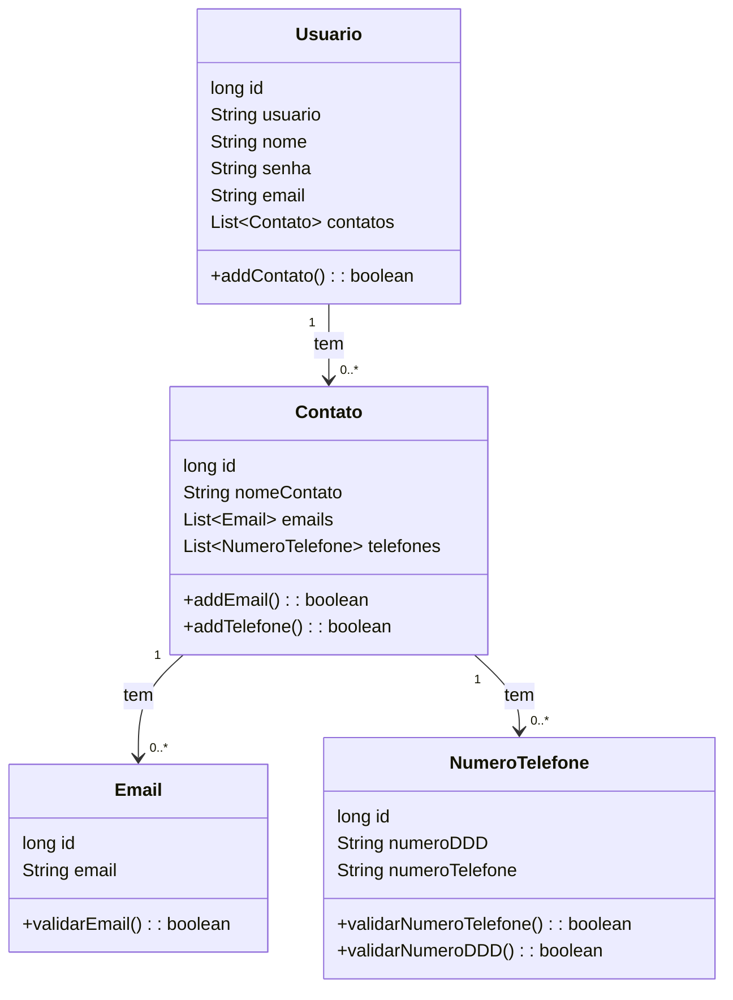

# AgendariaGoumert

Projeto para a disciplina de Desenvolvimento de Aplicações Web 2, o intuito do projeto é desenvolver o projeto seguindo as especificações do professor.

Descrição fornecida: Vocês irão fazer um sistema de agenda online usando Spring web MVC, Thymeleaf e banco de dados. Funcionalidades a seguir:

 - O usuário pode se cadastrar no sistema.
 - O usuário pode se logar no sistema.
 - Uma vez logado no sistema o usuário pode alterar a senha e as informações de perfil. 
 - Uma vez logado no sistema o usuário pode cadastrar contatos.
 - Na tela inicial do usuário ele deve ser capaz de ver todos os contatos que ele cadastrou e não pode ver os contatos de outros usuários.
 - Uma vez logado o usuário pode pesquisar uma lista de contatos por nome.
	 Ex. Se entre os contatos do usuário existirem os contatos José Marcio
	 Calado, Josivaldo Antonio, Joselito amaro e Andreia Josélia e o   
	 usuário pesquisar a palavra ¨jo¨, todos os contatos acima
	 devem ser apresentados
	 
Diagrama de classe:

Imagens dos Sistema.

A aplicação segue o seguinte fluxo, iniciando na tela de login, onde o usuário fornece um nome de usuário e senha para ter acesso a aplicação.
Caso o nome de usuário fornecido ou a senha fornecida não estejam presentes na base de dados, será exibido na tela uma mensagem de erro.
Pensando na chegada de novos usuários a pagina conta com um hiperlink que o leva diretamente para a tela de cadastro. 

Na tela de cadastro o usuário fornece uma série de informações para poder se cadastrar no sistema, sendo elas nome, email, senha e nome de usuario.
- nome de usuario e senha sendo os unicos dados que devem ser unicos no banco de dados.
- email ou senha já estejam cadastrados, será retornada uma mensagem de erro solicitando a auteração nos campos.
- embora não sejam muito utilizados os campos de nome e email foram adicionados no caso da aplicação acabar crescendo e esses dados se tornarem mais relevantes para ela.
- A devido a natureza simples do projeto, e de outros afazeres no horizonte, a criptografia da senha foi resumida a um hash simples, com a implementação fornecida pelo próprio objeto String, em deprimento de uma implementação propria do hashcode ou de metodos recomendados como o uso da classe BCryptPasswordEncoder.
Com um cadastro bem sucedido o usuário é imediatamento logado no sistema.

Ao chegar na homepage o usuário tem acesso a uma lista com todos os seus contatos, clicando no nome de um dos seus contatos o usuário é redirecionado para a pagina do mesmo, ainda na lista de usuários é possivel encontrar deletar um contato, adicionar um novo email ao contato e adicionar um novo número de telefone ao contato.
Ainda na tela de conta você encontra um botão que redireciona para a tela de adição de contatos e para a tela e uma barra de pesquisa usada para a filtragem da lista.

Quanto a pagina de adição de contatos, nela o usuário fornece o nome do contato, o primeiro email do contato e a primeira numero de contato do usuário, numero esse que é composto de DDD e Numero de telefone.
Um contato pode ter um ou mais informações de contato, então é possivel adicionar novos e excluir antigas informações de contato posteriormente.

O funcionamente do filtro, filtra apenas os contatos cujo nome iniciam com a string de busca. como no exemplo acima, mesmo que o contato "gustavo caio" tenha "caio" no nome, quando a silaba "ca" é usada como string de busca, apenas o contato "caio gustavo" é retornado, por ser o unico cujo o nome inicia com "ca".

Banco de dados

Como solicitado pela professor, a aplicação não faz uso do JPA, a conecção com o banco foi configurada atrávez da classe ConnectionManager. o banco escolhido foi SQLite, o banco foi optado por ser mais leve. além disso foi usado o padrão de projeto facade para gerenciar os repositórios que acessão o banco de dados.

  
